# Hyper Neuro Graph 🧠🚀
*A Multi-Agent SDLC Development Platform & Framework*


## 🌟 Overview

**Hyper Neuro Graph** is a foundation platform for building sophisticated multi-agent software development lifecycle (SDLC) systems. This repository provides the initial setup, framework, and tools for development teams to collaborate on creating a hierarchical network of AI agents that automate various aspects of software development.

### 🎯 Project Vision
Build a comprehensive tree-like agent architecture where AI agents collaborate to handle design, development, testing, deployment, and monitoring of software systems. The planned architecture will support 53+ specialized agents organized in a hierarchical structure.

### 🏗️ Current State
- ✅ **Foundation Setup**: Core infrastructure and framework ready
- ✅ **Development Environment**: Configured for team collaboration
- ✅ **Agent Framework**: Ready for agent development and integration
- 🚧 **Agent Network**: To be built by development team
- 🚧 **Specialized Agents**: Planned 53+ agents to be implemented

## 🏗️ Planned Architecture

### Hybrid SDLC Tree Architecture

```mermaid
graph TB
    SUPER[🎯 SDLC Supervisor]
    
    ARCH[🏛️ Architect Controller]
    CODE[💻 Code Controller] 
    TEST[🧪 Test Controller]
    REV[👁️ Review Controller]
    DEPLOY[🚀 Deploy Controller]
    MON[📊 Monitor Controller]
    
    SUPER --> ARCH
    SUPER --> CODE
    SUPER --> TEST
    SUPER --> REV
    SUPER --> DEPLOY
    SUPER --> MON
    
    subgraph "To Be Developed"
        ARCH -.-> A1[System Designer]
        ARCH -.-> A2[Pattern Analyst]
        CODE -.-> C1[Code Generator]
        CODE -.-> C2[Refactor Expert]
        TEST -.-> T1[Unit Tester]
        TEST -.-> T2[Integration Tester]
    end
```


### 📋 Planned Agent Network
- **1 Supervisor Agent**: Central orchestrator (to be developed)
- **6 Domain Controllers**: High-level coordinators (to be developed)
- **46+ Specialized Agents**: Domain experts (to be developed by team)
- **Total Target**: 53+ intelligent agents

## 🚀 Developer Onboarding

### 📋 Prerequisites
- **Python**: 3.12 or higher
- **Git**: Latest version
- **API Keys**: Anthropic API key for Claude models
- **IDE**: VS Code or PyCharm recommended

### ⚡ Quick Setup

1. **Clone and Navigate**
   ```bash
   git clone <repository-url>
   cd hyper-neuro-graph
   ```

2. **Environment Setup**
   ```bash
   # Create virtual environment
   python -m venv .venv
   source .venv/bin/activate  # Windows: .venv\Scripts\activate
   
   # Install dependencies
   pip install -r requirements.txt
   ```

3. **Configuration**
   ```bash
   # Copy environment template
   cp .env.example .env
   
   # Edit .env with your API keys
   nano .env  # or use your preferred editor
   ```

4. **Verify Setup**
   ```bash
   # Test environment
   ./diagnose_env.sh
   
   # Start the system
   python run.py
   ```

## 📖 How Things Work

### 🏗️ System Architecture

#### **1. Core Components**
```
Hyper Neuro Graph
├── 🎯 Neuro SAN Server     # Orchestration engine
├── 🌐 Agent Registry       # HOCON configurations
├── 🛠️ Toolbox             # Shared utilities
├── 📡 Communication Layer  # Agent messaging
└── 📊 Monitoring Studio    # Real-time visibility
```

#### **2. Agent Lifecycle**


#### **3. Communication Flow**
- **Orchestration**: Neuro SAN manages agent coordination
- **Messaging**: Async communication between agents
- **Workflows**: LangGraph handles complex multi-step processes  
- **Monitoring**: Real-time visibility in Neuro SAN Studio

### 🔧 Development Workflow

#### **Phase 1: Foundation (Current)**
```bash
# 1. Environment setup and validation
./diagnose_env.sh

# 2. Basic system verification
python run.py --validate

# 3. Access studio interface
# Navigate to http://localhost:8080
```

#### **Phase 2: Agent Development**
```bash
# 1. Create agent configuration
nano registries/my_agent.hocon

# 2. Implement agent logic
nano apps/my_agent/agent.py

# 3. Test agent locally
python -m tests.test_my_agent

# 4. Register and deploy
python run.py --register my_agent
```

## 🛠️ Development Best Practices

### 📋 **Agent Development Guidelines**

#### **1. Configuration First (HOCON)**
```hocon
# registries/example_agent.hocon
{
    "agent_name": "example_agent",
    "llm_config": {
        "model_name": "claude-3-5-sonnet-20241022",
        "provider": "anthropic",
        "temperature": 0.7,
        "max_tokens": 4096
    },
    "instructions": "You are a specialized agent for...",
    "tools": ["calculator", "web_search"],
    "down_chains": ["sub_agent_1", "sub_agent_2"]
}
```

#### **2. Modular Implementation**
```python
# apps/example_agent/agent.py
class ExampleAgent:
    def __init__(self, config):
        self.config = config
        self.llm = self._setup_llm()
        
    async def process_task(self, task):
        # Agent-specific logic here
        return result
        
    def _setup_llm(self):
        # LLM initialization
        pass
```

#### **3. Testing Strategy**
```python
# tests/test_example_agent.py
import pytest
from apps.example_agent.agent import ExampleAgent

# Test configuration setup
test_config = {
    "agent_name": "test_agent",
    "llm_config": {
        "model_name": "claude-3-5-sonnet-20241022",
        "provider": "anthropic",
        "temperature": 0.1
    },
    "capabilities": ["analyze", "generate", "validate"]
}

# Test task setup
test_task = {
    "type": "analysis",
    "content": "Analyze this sample code structure",
    "requirements": ["code_review", "suggestions"]
}

def test_agent_initialization():
    agent = ExampleAgent(test_config)
    assert agent.config is not None
    
async def test_task_processing():
    agent = ExampleAgent(test_config)
    result = await agent.process_task(test_task)
    assert result.success is True
```

### 🎯 **Best Practices Checklist**

#### **✅ Code Quality**
- [ ] Follow Python PEP 8 style guide
- [ ] Add comprehensive docstrings
- [ ] Implement error handling
- [ ] Write unit tests (>80% coverage)
- [ ] Use type hints throughout

#### **✅ Agent Design**
- [ ] Single responsibility principle
- [ ] Clear input/output contracts
- [ ] Proper logging and monitoring
- [ ] Graceful error handling
- [ ] Configurable behavior

#### **✅ Integration**
- [ ] HOCON configuration follows template
- [ ] Proper registration in manifest
- [ ] Communication protocols implemented
- [ ] Studio visibility enabled
- [ ] Documentation updated

### 🔧 **Development Workflow**

#### **1. Planning Phase**
```bash
# Review architecture document
cat HYBRID_SDLC_TREE_ARCHITECTURE.md

# Plan agent responsibilities
# Define interfaces and contracts
# Create development timeline
```

#### **2. Implementation Phase**
```bash
# Create feature branch
git checkout -b feature/agent-name

# Set up agent structure
mkdir -p apps/agent-name
mkdir -p tests/agent-name
touch registries/agent-name.hocon

# Implement and test
# Follow TDD approach
```

#### **3. Integration Phase**
```bash
# Test locally
python run.py --test-mode

# Integration tests
./run_integration_tests.sh

# Code review and merge
git push origin feature/agent-name
# Create pull request
```

## 🧪 Testing & Validation

### 🔧 **Environment Testing**
```bash
# Comprehensive environment check
./diagnose_env.sh

# Dependency validation
./fix_dependencies.sh --check-only

# Configuration validation  
python run.py --validate-config
```

### 🧪 **Agent Testing**
```bash
# Unit tests
python -m pytest tests/ -v

# Integration tests
python -m pytest tests/integration/ -v

# Load testing
python -m tests.load_test --agents 10
```

### 📊 **Performance Monitoring**
```bash
# Start with monitoring
python run.py --monitor

# Check metrics
curl http://localhost:8080/metrics

# View logs
tail -f logs/agent_thinking.txt
```

## 🏗️ Project Structure & Guidelines

### 📁 **Directory Organization**
```
hyper-neuro-graph/
├── 📁 apps/                    # Individual agent implementations
│   ├── conscious_assistant/    # Conversational AI interface
│   ├── cruse/                  # Multi-agent web client
│   ├── log_analyzer/           # Log analysis tools
│   ├── wwaw/                   # Web Agent Network Builder
│   ├── agents/                 # Additional agent implementations
│   └── example_agent/          # Example template agent
├── 📁 coded_tools/            # Custom tools and utilities
│   └── advanced_calculator/    # Calculator tool implementation
├── 📁 registries/             # HOCON agent configurations
│   ├── six_thinking_hats.hocon # Six thinking hats agent config
│   ├── hybrid_architect_controller.hocon # Architect controller config
│   └── manifest.hocon          # Agent registry manifest
├── 📁 servers/                # Server components and APIs
│   ├── a2a/                   # Agent-to-agent communication
│   └── mcp/                   # MCP (Model Context Protocol) server
├── 📁 deploy/                 # Deployment configurations
│   ├── Dockerfile             # Container definition
│   ├── build.sh               # Build script
│   ├── run.sh                 # Run script
│   ├── entrypoint.sh          # Container entrypoint
│   └── logging.json           # Logging configuration
├── 📁 tests/                  # Test suites
│   ├── apps/                  # Application tests
│   └── coded_tools/           # Tool tests
├── 📁 docs/                   # Documentation
│   ├── user_guide.md          # User guide
│   ├── api_key.md             # API key documentation
│   ├── examples.md            # Examples and tutorials
│   ├── comparative_analysis.md # Comparative analysis
│   ├── examples/              # Example configurations
│   └── images/                # Documentation images
├── 📁 toolbox/                # Shared tools and resources
│   └── toolbox_info.hocon     # Tool configurations
├── 📁 logs/                   # Application logs
│   ├── agent_thinking.txt     # Agent conversation logs
│   └── thinking_dir/          # Detailed agent logs
├── 📄 HYBRID_SDLC_TREE_ARCHITECTURE.md # Complete architecture design
├── 📄 run.py                  # Main entry point
├── 📄 pyproject.toml          # Project configuration
├── 📄 requirements.txt        # Python dependencies
├── 📄 requirements-build.txt  # Build dependencies
├── 📄 Makefile                # Build automation
├── 📄 .env.example           # Environment template
├── 📄 .gitignore             # Git ignore rules
├── 🔧 diagnose_env.sh         # Environment diagnostic script
└── 🔧 fix_dependencies.sh     # Dependency fix script
```

### 📋 **Naming Conventions**
- **Agents**: `snake_case` (e.g., `code_generator`, `test_runner`)
- **Classes**: `PascalCase` (e.g., `CodeGenerator`, `TestRunner`)
- **Functions**: `snake_case` (e.g., `process_task`, `validate_input`)
- **Files**: `snake_case.py` (e.g., `agent_utils.py`, `config_loader.py`)

### 🔧 **Configuration Management**
```bash
# Environment variables
cp .env.example .env
# Edit with actual values

# Agent configurations
# Use HOCON format for all configs
# Follow existing templates
# Validate before committing
```

## 📚 Resources & Learning

### 📖 **Essential Reading**
- **[Architecture Guide](HYBRID_SDLC_TREE_ARCHITECTURE.md)**: Complete system design
- **[Agent Development Guide](docs/agent_development.md)**: Step-by-step agent creation
- **[API Reference](docs/api_reference.md)**: Complete API documentation
- **[Best Practices](docs/best_practices.md)**: Code quality guidelines

### 🔗 **External Resources**
- **[Neuro SAN Documentation](https://github.com/cognizant-ai-lab/neuro-san-studio)**
- **[LangGraph Guide](https://langchain-ai.github.io/langgraph/)**
- **[HOCON Format](https://github.com/lightbend/config/blob/master/HOCON.md)**
- **[Anthropic API](https://docs.anthropic.com/)**

## 🤝 Contributing

### 📋 **Contribution Workflow**
1. **Fork & Clone**: Get your own copy
2. **Branch**: Create feature branch
3. **Develop**: Follow best practices
4. **Test**: Comprehensive testing
5. **Document**: Update relevant docs
6. **Submit**: Create pull request

### 🔍 **Code Review Checklist**
- [ ] Code follows style guidelines
- [ ] Tests pass and coverage >80%
- [ ] Documentation updated
- [ ] No breaking changes
- [ ] Performance impact assessed

## 🛠️ Troubleshooting

### 🔧 **Common Issues**

#### **Environment Problems**
```bash
# Diagnose issues
./diagnose_env.sh

# Fix dependencies
./fix_dependencies.sh

# Reset environment
rm -rf .venv
python -m venv .venv
pip install -r requirements.txt
```

#### **Agent Registration Issues**
```bash
# Validate HOCON syntax
python -c "import pyhocon; pyhocon.ConfigFactory.parse_file('registries/agent.hocon')"

# Check agent manifest
python run.py --list-agents

# Refresh registry
python run.py --refresh-registry
```

#### **Communication Issues**
```bash
# Check port availability
netstat -an | grep 8080

# Restart services
./stop_neuro_san.sh
./start_neuro_san.sh

# Monitor connections
tail -f logs/communication.log
```

### 📞 **Getting Help**
- **Documentation**: Check `/docs` directory
---

**Ready to build the future of AI-powered software development?** 🚀

*Start with the setup guide above and join the development team in creating revolutionary multi-agent systems!*
