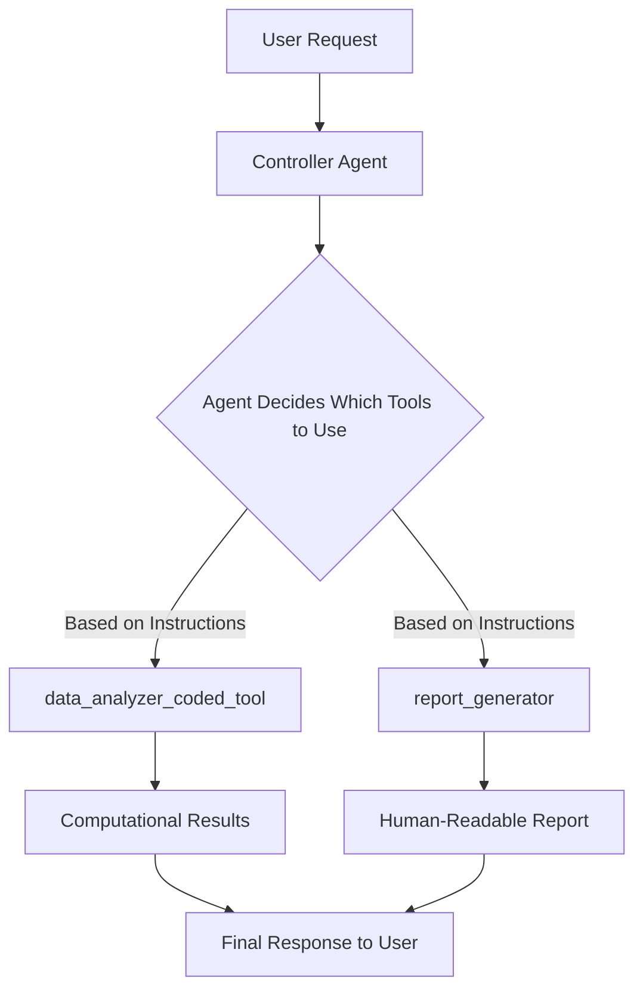
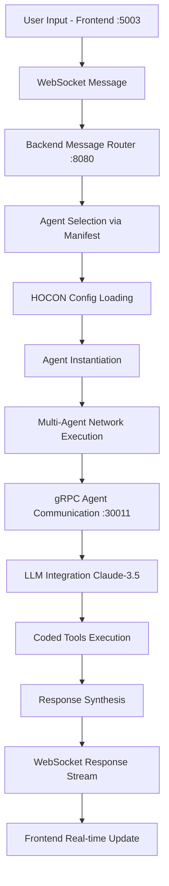

# Hyper Neuro Graph Service Architecture

## Overview

Hyper Neuro Graph is a sophisticated multi-agent orchestration platform that enables declarative agent creation using HOCON configuration files. The system bridges human-readable configuration with dynamic AI agent execution, supporting complex multi-agent workflows and real-time communication.

## Table of Contents

- [Overview](#overview)
- [System Architecture](#system-architecture)
  - [Core Components](#core-components)
  - [Key Services](#key-services)
- [HOCON Agent Configuration](#hocon-agent-configuration)
  - [What is HOCON?](#what-is-hocon)
  - [Agent Registry System](#agent-registry-system)
    - [Manifest Registration](#manifest-registration-registriesmanifesthocon)
    - [Agent Configuration Structure](#agent-configuration-structure)
- [Agent Orchestration and Workflows](#agent-orchestration-and-workflows)
  - [How Agent Orchestration Actually Works](#how-agent-orchestration-actually-works)
    - [Correct Orchestration Pattern](#correct-orchestration-pattern)
    - [Execution Flow](#execution-flow)
    - [Key Points](#key-points)
    - [Example Multi-Agent Coordination](#example-multi-agent-coordination)
- [Message Processing Pipeline](#message-processing-pipeline)
  - [Complete Flow from Frontend to Response](#complete-flow-from-frontend-to-response)
  - [Detailed Processing Steps](#detailed-processing-steps)
- [Coded Tools Integration](#coded-tools-integration)
  - [When to Use Coded Tools vs HOCON-Only](#when-to-use-coded-tools-vs-hocon-only)
  - [Coded Tool Interface](#coded-tool-interface)
  - [Sly Data: The Private Data Channel](#sly-data-the-private-data-channel)
    - [Key Characteristics](#key-characteristics)
    - [Sly Data Use Cases](#sly-data-use-cases)
      - [Security & Authentication](#1-security--authentication)
      - [Multi-Tool Coordination](#2-multi-tool-coordination)
      - [Session State Management](#3-session-state-management)
      - [Debug & Monitoring](#4-debug--monitoring-invisible-to-user)
  - [Directory Structure for Coded Tools](#directory-structure-for-coded-tools)
  - [HOCON Integration](#hocon-integration)
  - [Best Practices for Coded Tools](#best-practices-for-coded-tools)
  - [Workflow Implementation in Coded Tools](#workflow-implementation-in-coded-tools)
    - [Simple Workflow Example](#simple-workflow-example)
    - [HOCON Configuration for Workflow Tool](#hocon-configuration-for-workflow-tool)
    - [Usage Example](#usage-example)
    - [Key Workflow Patterns](#key-workflow-patterns)
- [Configuration Reference](#configuration-reference)
  - [HOCON Configuration Methods](#hocon-configuration-methods)
    - [Basic Configuration](#1-basic-configuration)
    - [Variable Substitution](#2-variable-substitution)
    - [Object Merging](#3-object-merging)
    - [File Includes](#4-file-includes)
    - [Comments and Documentation](#5-comments-and-documentation)
    - [Path Expressions](#6-path-expressions)
    - [Duration and Size Units](#7-duration-and-size-units)
  - [Environment Variables Integration](#environment-variables-integration)
- [Examples](#examples)
  - [Sample Agent with Coded Tool Integration](#sample-agent-with-coded-tool-integration)
    - [Sample Agent Configuration](#1-sample-agent-configuration-registriessample_data_processorhocon)
- [Getting Started](#getting-started)

## System Architecture

### Core Components

```
┌─────────────────────────────────────────────────────────────┐
│                    Hyper Neuro Graph                       │
├─────────────────────────────────────────────────────────────┤
│  Frontend (port 5003)    │  NSFlow Dev Server (port 4173)  │
│  ├─ Web Interface        │  ├─ Development Tools           │
│  ├─ WebSocket Client     │  └─ Hot Reloading               │
│  └─ Real-time Updates    │                                  │
├─────────────────────────────────────────────────────────────┤
│              Backend Services                               │
│  ├─ HTTP Server (port 8080)     ├─ gRPC Server (port 30011)│
│  │  ├─ REST API Endpoints       │  ├─ Agent-to-Agent Comm  │
│  │  ├─ WebSocket Handler        │  ├─ High Performance     │
│  │  └─ Message Router           │  └─ Inter-agent Protocol │
│  └─ NeuroSanRunner (Orchestrator)                          │
├─────────────────────────────────────────────────────────────┤
│              Agent System (A2A Pattern)                    │
│  ├─ Agent Registry (manifest.hocon)                        │
│  ├─ HOCON Configuration Parser                             │
│  ├─ Dynamic Agent Instantiation                            │
│  └─ Multi-Agent Network Orchestration                      │
├─────────────────────────────────────────────────────────────┤
│              External Integrations                         │
│  ├─ LLM Integration (Claude-3.5-Sonnet)                   │
│  ├─ Coded Tools (Python Extensions)                        │
│  └─ Environment Variable Support                           │
└─────────────────────────────────────────────────────────────┘
```

### Key Services

- **NeuroSanRunner**: Main orchestrator class that manages all services
- **Agent Registry**: HOCON-based agent configuration management
- **A2A (Agent-to-Agent)**: Communication pattern for multi-agent workflows
- **Real-time Logging**: Agent thinking and decision tracking

## HOCON Agent Configuration

### What is HOCON?

HOCON (Human-Optimized Config Object Notation) is a JSON superset designed for human-editable configuration files. It provides:

- **JSON Compatibility**: All valid JSON is valid HOCON
- **Human-Friendly**: Less noisy syntax, comments, flexible formatting
- **Advanced Features**: Variable substitution, includes, merging

### Agent Registry System

#### Manifest Registration (`registries/manifest.hocon`)
```hocon
{
    "hybrid_architect_controller.hocon": true,
    "six_thinking_hats.hocon": true,
    "sample_data_processor.hocon": true  # Your custom agents
}
```

#### Agent Configuration Structure

```hocon
{
    # LLM Configuration for the agent
    "llm_config": {
        "model_name": "claude-3-5-sonnet-20241022",
        "provider": "anthropic",
        "temperature": 0.7,
        "max_tokens": 4096,
        "timeout": 30
    },

    # Multi-agent workflow settings
    "max_iterations": 50,
    "recursion_limit": 25,
    "enable_internal_chat": true,
    "enable_visualization": true,

    # Tools array - defines agent capabilities
    "tools": [
        {
            "name": "agent_name",
            "function": {
                "description": "Agent description and capabilities",
                "parameters": {
                    "type": "object",
                    "properties": {
                        "input_param": {
                            "type": "string",
                            "description": "Parameter description"
                        }
                    },
                    "required": ["input_param"]
                }
            },
            "instructions": "Detailed instructions for agent behavior",
            "tools": ["other_agent_1", "other_agent_2"],  # Agent dependencies
            "llm_config": {
                # Override global LLM config for this agent
                "temperature": 0.3
            }
        }
    ]
}
```

## Agent Orchestration and Workflows

### How Agent Orchestration Actually Works

**Important**: While HOCON configurations can include `workflow` definitions, the current system **does not use** these workflow definitions for execution. Instead, agent orchestration happens through the **`tools` array pattern**.

#### **Correct Orchestration Pattern**

```hocon
{
    "tools": [
        {
            "name": "controller_agent",
            "function": {
                "description": "Main controller that orchestrates other agents"
            },
            "instructions": "You coordinate multiple agents. Always call data_analyzer_coded_tool first for computational tasks, then call report_generator for human-readable insights.",
            "tools": ["data_analyzer_coded_tool", "report_generator"],  # <-- This is the key!
            "llm_config": {
                "model_name": "claude-3-5-sonnet-20241022",
                "temperature": 0.3
            }
        }
    ]
}
```

#### **Execution Flow**



#### **Key Points**
- **Agent instructions** guide the orchestration logic
- **Tools array** defines available agents/tools
- **LLM reasoning** determines execution order and conditions
- **No separate workflow engine** - orchestration is AI-driven

#### **Example Multi-Agent Coordination**

```hocon
# From hybrid_architect_controller.hocon
{
    "name": "architect_controller",
    "tools": [
        "requirements_analyzer",
        "domain_expert", 
        "pattern_matcher",
        "hld_generator",
        "lld_generator",
        "tech_stack_advisor",
        "security_architect",
        "scalability_planner",
        "cost_estimator"
    ],
    "instructions": "You orchestrate 9 specialized agents to design software architecture..."
}
```

The controller agent uses AI reasoning to decide which tools to call, in what order, and with what parameters - providing flexible, context-aware orchestration.

## Message Processing Pipeline

### Complete Flow from Frontend to Response



### Detailed Processing Steps

1. **Frontend Capture**: User input captured via modern web interface
2. **WebSocket Transport**: Real-time bidirectional communication
3. **Message Routing**: Backend determines appropriate agent(s)
4. **Agent Selection**: Consults `manifest.hocon` for available agents
5. **Configuration Loading**: HOCON parser loads agent definitions
6. **Dynamic Instantiation**: Agents created based on configuration
7. **Multi-Agent Orchestration**: Controller agents manage sub-agent workflows
8. **LLM Integration**: Each agent processes via configured language model
9. **Coded Tools Execution**: Custom Python logic when needed
10. **Response Aggregation**: Results synthesized by controller agent
11. **Real-time Streaming**: WebSocket delivers response to frontend

## Coded Tools Integration

### When to Use Coded Tools vs HOCON-Only

| Use HOCON-Only When: | Use Coded Tools When: |
|----------------------|----------------------|
| ✅ Simple agent orchestration | ✅ Complex computational logic needed |
| ✅ LLM-based reasoning tasks | ✅ External API integrations required |
| ✅ Text processing and analysis | ✅ Mathematical calculations |
| ✅ Decision-making workflows | ✅ File system operations |
| ✅ Agent-to-agent communication | ✅ Database interactions |
| ✅ Templated responses | ✅ Custom data processing |

### Coded Tool Interface

All coded tools in the neuro-san framework must implement the `CodedTool` interface with the correct `invoke` method signature:

```python
from neuro_san.interfaces.coded_tool import CodedTool
from typing import Any, Dict

class CustomCodedTool(CodedTool):
    """Custom coded tool implementing specialized logic."""
    
    def invoke(self, args: Dict[str, Any], sly_data: Dict[str, Any]) -> Dict[str, Any]:
        """
        Execute the coded tool operation.
        
        Args:
            args: Dictionary containing operation parameters from HOCON schema:
                - Keys defined in the agent's HOCON tool configuration
                - Values passed by the calling LLM/agent
            sly_data: Private data channel (invisible to chat stream):
                - Credentials, tokens, user IDs
                - Internal state and coordination data
                - Debug information and metrics
                
        Returns:
            Dictionary containing operation results
        """
        # Extract parameters from args
        operation = args.get("operation")
        data = args.get("data")
        
        # Access private context from sly_data
        user_id = sly_data.get("user_id")
        session_token = sly_data.get("session_token")
        
        # Perform operation
        result = self._perform_operation(operation, data)
        
        # Store internal state in sly_data for other tools
        sly_data["last_operation"] = {
            "tool": self.__class__.__name__,
            "operation": operation,
            "timestamp": datetime.now(),
            "user_id": user_id
        }
        
        return result
```

### Sly Data: The Private Data Channel

**Sly data** is a crucial concept in neuro-san that provides a **private, invisible data channel** between coded tools and agents.

#### **Key Characteristics:**
- **Never appears in chat streams** or LLM conversations
- **Shared between all coded tools** in an agent network
- **Persists across tool calls** within a session
- **Used for sensitive and coordination data**

#### **Sly Data Use Cases:**

##### **1. Security & Authentication**
```python
def invoke(self, args, sly_data):
    # Access hidden credentials
    api_key = sly_data.get("external_api_key")
    db_token = sly_data.get("database_token")
    user_permissions = sly_data.get("user_permissions", [])
    
    # These never appear in chat logs
    if "admin" not in user_permissions:
        return {"error": "Insufficient permissions"}
        
    result = secure_api_call(api_key, args["query"])
    return result
```

##### **2. Multi-Tool Coordination**
```python
# Tool A: Data Preprocessor
def invoke(self, args, sly_data):
    processed_data = preprocess(args["raw_data"])
    
    # Share metadata with next tools
    sly_data["preprocessing_metadata"] = {
        "normalization_params": {"mean": 100, "std": 15},
        "outliers_removed": 3,
        "data_quality_score": 0.85
    }
    return {"status": "processed"}

# Tool B: Data Analyzer
def invoke(self, args, sly_data):
    # Access previous tool's metadata
    metadata = sly_data.get("preprocessing_metadata", {})
    
    # Adapt behavior based on shared context
    if metadata.get("data_quality_score", 0) < 0.7:
        analysis_mode = "robust"
    else:
        analysis_mode = "standard"
        
    return perform_analysis(args["data"], analysis_mode)
```

##### **3. Session State Management**
```python
def invoke(self, args, sly_data):
    # Maintain session-level state
    session_history = sly_data.get("session_history", [])
    session_history.append({
        "tool": self.__class__.__name__,
        "operation": args.get("operation"),
        "timestamp": datetime.now(),
        "user_query": args.get("query")
    })
    sly_data["session_history"] = session_history
    
    # Behavior changes based on history
    if len(session_history) > 10:
        return {
            "result": perform_operation(args),
            "suggestion": "Consider using batch processing for efficiency"
        }
```

##### **4. Debug & Monitoring (Invisible to User)**
```python
def invoke(self, args, sly_data):
    start_time = time.time()
    
    result = complex_operation(args["data"])
    
    # Add debug metrics (never shown to user)
    sly_data.setdefault("performance_metrics", []).append({
        "tool": self.__class__.__name__,
        "execution_time": time.time() - start_time,
        "memory_usage": get_memory_usage(),
        "data_size": len(args.get("data", [])),
        "timestamp": datetime.now()
    })
    
    return result
```

### Directory Structure for Coded Tools

```
coded_tools/
├── data_analyzer/
│   └── data_analyzer_tool.py          # DataAnalyzerCodedTool
├── advanced_calculator/
│   └── calculator_tool.py             # CalculatorCodedTool
├── file_manager/
│   └── file_manager_tool.py           # File operations
└── api_connector/
    └── api_connector_tool.py           # External API calls
```

### HOCON Integration

Coded tools are referenced in HOCON configurations using the `coded_tool_path` field:

```hocon
{
    "name": "data_analyzer_coded_tool",
    "type": "coded_tool",
    "function": {
        "description": "Performs complex data analysis operations",
        "parameters": {
            "type": "object",
            "properties": {
                "operation": {
                    "type": "string",
                    "enum": ["analyze", "filter", "transform", "statistics"]
                },
                "data": {
                    "type": "string",
                    "description": "JSON string or comma-separated values"
                }
            },
            "required": ["operation", "data"]
        }
    },
    "coded_tool_path": "coded_tools.data_analyzer.data_analyzer_tool.DataAnalyzerCodedTool",
    "instructions": "Execute computational operations requiring precise mathematical processing."
}
```

### Best Practices for Coded Tools

1. **Use sly_data for sensitive information** - Never put credentials or private data in args
2. **Implement proper error handling** - Return structured error responses
3. **Add logging with completion markers** - Use `logger.info(f"********** {self.__class__.__name__} completed **********")`
4. **Validate inputs thoroughly** - Check args for required parameters and data types
5. **Coordinate via sly_data** - Share state and metadata between tools invisibly
6. **Keep args simple** - Use strings for complex data, parse internally
7. **Return structured results** - Use dictionaries with success flags and detailed results

### Workflow Implementation in Coded Tools

⚠️ **Important**: The Hyper Neuro Graph system **does not use explicit workflow definitions** in HOCON files. Any `workflow` sections in HOCON configurations are **ignored by the system**.

Instead, **workflow-like behavior is implemented within coded tools** using internal step processing and sly_data coordination.

#### Simple Workflow Example

Here's a practical example of implementing a multi-step workflow within a coded tool:

```python
from neuro_san.interfaces.coded_tool import CodedTool
from typing import Any, Dict
import logging
import time

logger = logging.getLogger(__name__)

class DataProcessingWorkflowTool(CodedTool):
    """Coded tool implementing internal workflow steps."""
    
    def invoke(self, args: Dict[str, Any], sly_data: Dict[str, Any]) -> Dict[str, Any]:
        """Execute multi-step data processing workflow."""
        
        operation = args.get("operation", "full_pipeline")
        data = args.get("data", "")
        
        # Initialize workflow state
        workflow_state = {
            "pipeline_id": f"workflow_{int(time.time())}",
            "steps_completed": [],
            "current_step": 1,
            "total_steps": 4
        }
        
        try:
            # Step 1: Data Validation
            logger.info("Starting Step 1: Data Validation")
            validation_result = self._validate_data(data)
            if not validation_result["valid"]:
                return self._workflow_error("validation", validation_result["error"], workflow_state)
            
            workflow_state["steps_completed"].append("validation")
            workflow_state["current_step"] = 2
            
            # Step 2: Data Cleaning  
            logger.info("Starting Step 2: Data Cleaning")
            cleaned_data = self._clean_data(validation_result["data"])
            workflow_state["steps_completed"].append("cleaning")
            workflow_state["current_step"] = 3
            
            # Step 3: Data Transformation
            logger.info("Starting Step 3: Data Transformation") 
            transformed_data = self._transform_data(cleaned_data, operation)
            workflow_state["steps_completed"].append("transformation")
            workflow_state["current_step"] = 4
            
            # Step 4: Result Formatting
            logger.info("Starting Step 4: Result Formatting")
            final_result = self._format_result(transformed_data)
            workflow_state["steps_completed"].append("formatting")
            workflow_state["current_step"] = "completed"
            
            # Store workflow metadata in sly_data for other tools
            sly_data["last_workflow"] = {
                "tool": self.__class__.__name__,
                "pipeline_id": workflow_state["pipeline_id"],
                "steps": workflow_state["steps_completed"],
                "execution_time": time.time(),
                "data_processed": len(str(data))
            }
            
            logger.info(f"********** {self.__class__.__name__} workflow completed **********")
            
            return {
                "success": True,
                "result": final_result,
                "workflow_info": {
                    "pipeline_id": workflow_state["pipeline_id"],
                    "steps_completed": workflow_state["steps_completed"],
                    "total_steps": workflow_state["total_steps"]
                }
            }
            
        except Exception as e:
            return self._workflow_error("execution", str(e), workflow_state)
    
    def _validate_data(self, data: str) -> Dict[str, Any]:
        """Step 1: Validate input data."""
        if not data or len(data.strip()) == 0:
            return {"valid": False, "error": "Empty data provided"}
        
        # Parse data (JSON or CSV)
        try:
            if data.startswith('[') or data.startswith('{'):
                import json
                parsed_data = json.loads(data)
            else:
                parsed_data = [x.strip() for x in data.split(',') if x.strip()]
            
            return {"valid": True, "data": parsed_data}
        except Exception as e:
            return {"valid": False, "error": f"Data parsing failed: {str(e)}"}
    
    def _clean_data(self, data: list) -> list:
        """Step 2: Clean and normalize data."""
        if isinstance(data, list):
            # Remove empty items and normalize
            cleaned = [str(item).strip() for item in data if str(item).strip()]
            return cleaned
        else:
            return [str(data)]
    
    def _transform_data(self, data: list, operation: str) -> Dict[str, Any]:
        """Step 3: Transform data based on operation."""
        if operation == "count":
            return {"operation": "count", "result": len(data)}
        elif operation == "uppercase":
            return {"operation": "uppercase", "result": [item.upper() for item in data]}
        elif operation == "statistics" and all(self._is_number(item) for item in data):
            numbers = [float(item) for item in data]
            return {
                "operation": "statistics",
                "result": {
                    "count": len(numbers),
                    "sum": sum(numbers),
                    "average": sum(numbers) / len(numbers),
                    "min": min(numbers),
                    "max": max(numbers)
                }
            }
        else:
            return {"operation": operation, "result": data}
    
    def _format_result(self, data: Dict[str, Any]) -> Dict[str, Any]:
        """Step 4: Format final result."""
        return {
            "processed_data": data,
            "metadata": {
                "processing_timestamp": time.time(),
                "processor": "DataProcessingWorkflowTool"
            }
        }
    
    def _is_number(self, value: str) -> bool:
        """Helper: Check if string represents a number."""
        try:
            float(value)
            return True
        except ValueError:
            return False
    
    def _workflow_error(self, step: str, error: str, state: Dict[str, Any]) -> Dict[str, Any]:
        """Handle workflow errors with detailed state information."""
        logger.error(f"Workflow failed at step: {step} - {error}")
        return {
            "success": False,
            "error": f"Workflow failed at {step}: {error}",
            "workflow_state": {
                "failed_step": step,
                "completed_steps": state.get("steps_completed", []),
                "pipeline_id": state.get("pipeline_id", "unknown")
            }
        }
```

#### HOCON Configuration for Workflow Tool

```hocon
{
    "name": "data_workflow_processor",
    "type": "coded_tool",
    "function": {
        "description": "Processes data through a multi-step workflow: validation → cleaning → transformation → formatting",
        "parameters": {
            "type": "object",
            "properties": {
                "operation": {
                    "type": "string",
                    "enum": ["count", "uppercase", "statistics", "full_pipeline"],
                    "description": "Type of data processing workflow to execute"
                },
                "data": {
                    "type": "string", 
                    "description": "Input data as JSON array, CSV string, or plain text"
                }
            },
            "required": ["data"]
        }
    },
    "coded_tool_path": "coded_tools.workflow_processor.workflow_tool.DataProcessingWorkflowTool",
    "instructions": "Execute structured data processing through validation, cleaning, transformation, and formatting steps. Track progress and handle errors gracefully."
}
```

#### Usage Example

```json
{
    "operation": "statistics",
    "data": "10, 20, 30, 40, 50"
}
```

**Response:**
```json
{
    "success": true,
    "result": {
        "processed_data": {
            "operation": "statistics",
            "result": {
                "count": 5,
                "sum": 150,
                "average": 30,
                "min": 10,
                "max": 50
            }
        },
        "metadata": {
            "processing_timestamp": 1703123456.789,
            "processor": "DataProcessingWorkflowTool"
        }
    },
    "workflow_info": {
        "pipeline_id": "workflow_1703123456",
        "steps_completed": ["validation", "cleaning", "transformation", "formatting"],
        "total_steps": 4
    }
}
```

#### Key Workflow Patterns

1. **Sequential Steps**: Each step processes the output of the previous step
2. **State Tracking**: Use workflow_state dictionary to track progress
3. **Error Handling**: Graceful failure with state preservation
4. **Sly Data Coordination**: Share workflow metadata with other tools
5. **Resumable Design**: Workflow state enables checkpoint/resume functionality

## Configuration Reference

### HOCON Configuration Methods

#### 1. Basic Configuration
```hocon
{
    key = "value"
    number = 42
    boolean = true
    array = [1, 2, 3]
}
```

#### 2. Variable Substitution
```hocon
{
    base_url = "https://api.example.com"
    endpoint = ${base_url}"/data"
    
    # Environment variable substitution
    api_key = ${API_KEY}
    
    # Default values
    timeout = ${TIMEOUT:-30}
}
```

#### 3. Object Merging
```hocon
{
    llm_config = {
        model_name = "claude-3-5-sonnet-20241022"
        temperature = 0.7
    }
    
    # Override specific values
    llm_config = ${llm_config} {
        temperature = 0.3
    }
}
```

#### 4. File Includes
```hocon
{
    # Include another HOCON file
    include "base_config.hocon"
    
    # Override included values
    custom_setting = "override_value"
}
```

#### 5. Comments and Documentation
```hocon
{
    # This is a line comment
    key = "value" // This is an end-of-line comment
    
    /*
     * This is a multi-line comment
     * for detailed documentation
     */
    complex_config = {
        setting = true
    }
}
```

#### 6. Path Expressions
```hocon
{
    server.host = "localhost"
    server.port = 8080
    
    # Equivalent to:
    server = {
        host = "localhost"
        port = 8080
    }
}
```

#### 7. Duration and Size Units
```hocon
{
    timeout = 30s              # seconds
    cache_duration = 5m        # minutes
    max_wait = 2h              # hours
    
    max_memory = 512MB         # megabytes
    file_size_limit = 2GB      # gigabytes
    buffer_size = 64KB         # kilobytes
}
```

### Environment Variables Integration

```hocon
{
    # Direct environment variable usage
    database_url = ${DATABASE_URL}
    
    # With default fallback
    log_level = ${LOG_LEVEL:-info}
    
    # Nested in configuration
    llm_config = {
        api_key = ${ANTHROPIC_API_KEY}
        model = ${LLM_MODEL:-"claude-3-5-sonnet-20241022"}
    }
}
```

## Examples

### Sample Agent with Coded Tool Integration

Let me create a sample data processing agent that uses coded tools:

#### 1. Sample Agent Configuration (`registries/sample_data_processor.hocon`)
```hocon
{
    "llm_config": {
        "model_name": "claude-3-5-sonnet-20241022",
        "provider": "anthropic",
        "temperature": 0.5,
        "max_tokens": 2048,
    },

    "max_iterations": 20,
    "recursion_limit": 10,
    "enable_internal_chat": true,
    "enable_visualization": true,

    "tools": [
        {
            "name": "data_processor_controller",
            "function": {
                "description": "I am a Data Processing Controller that can analyze, transform, and visualize data using both AI reasoning and coded computational tools."
            },
            "instructions": "You are a data processing specialist. Use the data_analyzer coded tool for complex calculations and the AI reasoning for interpretation and insights.",
            "tools": ["data_analyzer_coded_tool", "report_generator"],
            "llm_config": {
                "model_name": "claude-3-5-sonnet-20241022",
                "temperature": 0.3,
            }
        },
        
        {
            "name": "data_analyzer_coded_tool",
            "type": "coded_tool",
            "function": {
                "description": "Performs complex data analysis operations including statistics, filtering, and transformations.",
                "parameters": {
                    "type": "object",
                    "properties": {
                        "operation": {
                            "type": "string",
                            "enum": ["count", "uppercase", "statistics", "full_pipeline"],
                            "description": "The data operation to perform"
                        },
                        "data": {
                            "type": "string", 
                            "description": "Input data as JSON array, CSV string, or plain text"
                        },
                        "parameters": {
                            "type": "object",
                            "description": "Operation-specific parameters"
                        }
                    },
                    "required": ["data"]
                }
            },
            "coded_tool_path": "coded_tools.data_analyzer.data_analyzer_tool.DataAnalyzerCodedTool",
            "instructions": "Execute computational data operations that require precise mathematical processing."
        },

        {
            "name": "report_generator", 
            "function": {
                "description": "Generates human-readable reports from processed data.",
                "parameters": {
                    "type": "object",
                    "properties": {
                        "processed_data": {
                            "type": "object",
                            "description": "The processed data results"
                        },
                        "report_type": {
                            "type": "string",
                            "enum": ["summary", "detailed", "executive"],
                            "description": "Type of report to generate"
                        }
                    },
                    "required": ["processed_data"]
                }
            },
            "instructions": "Generate clear, insightful reports that explain data findings in human-readable format.",
            "llm_config": {
                "temperature": 0.7,
                "max_tokens": 3000
            }
        }
    ]
}
```

This documentation provides a comprehensive understanding of how your Hyper Neuro Graph service works, from HOCON configuration to coded tools integration. The system's power lies in its ability to combine declarative agent definition with dynamic execution and specialized computational tools.

## Getting Started

1. **Create Agent Configuration**: Define your agent in a `.hocon` file
2. **Register in Manifest**: Add your agent to `registries/manifest.hocon`
3. **Add Coded Tools**: Implement custom Python logic when needed
4. **Test via Frontend**: Access the web interface at `localhost:5003`
5. **Monitor Execution**: Watch agent thinking in real-time logs

The system automatically reloads configurations every 5 seconds, enabling rapid development and testing of multi-agent workflows.
